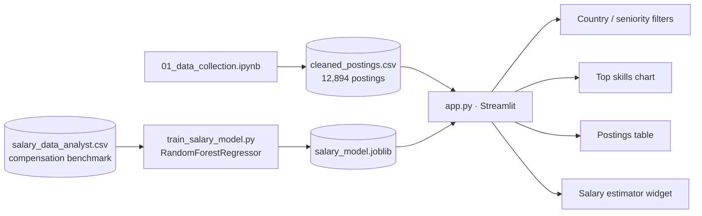

# Data Analyst Job Market Dashboard

🔗 **[Live Demo](https://data-analyst-job-market-bwgscrw3mdichimrlbahfk.streamlit.app/)**

An end-to-end analysis of the Data Analyst job market -- scraped job postings, EDA on in-demand skills, and a salary prediction model -- surfaced through an interactive Streamlit dashboard.

## The problem

Job seekers and career-switchers targeting Data Analyst roles often rely on anecdotal advice about which skills matter or what salary to expect. This project instead scrapes real job postings and a separate compensation dataset to answer those questions with data: which skills actually show up most often, how skill demand differs by country and seniority, and what a given profile (country, experience, industry, etc.) should realistically expect to earn.

## How it works

1. **Collect** (`01_data_collection.ipynb`) -- scrapes Data Analyst postings (Indeed/LinkedIn-sourced), producing 12,894 cleaned postings across multiple countries and seniority levels
2. **Clean & engineer** -- extracts per-skill boolean flags (`skill_*` columns) from free-text postings for aggregate skill-frequency analysis
3. **Explore** -- generates skill-frequency, trendy-vs-traditional skill comparison, skill co-occurrence heatmap, skills-by-country, and salary-by-experience charts (`charts/`)
4. **Model** (`train_salary_model.py`) -- trains a `RandomForestRegressor` on a separate salary benchmark dataset to predict `salary_usd` from country, experience level, education, industry, company size, and work mode
5. **Serve** (`app.py`) -- Streamlit dashboard with country/seniority filters, a live top-skills chart, a browsable postings table, and a salary estimator widget

## Architecture



## Key metrics

Model evaluation (`train_salary_model.py`), reported against a mean-prediction baseline rather than in isolation:

```
Test MAE:  $<printed at train time>
Test R^2:  <printed at train time>
Baseline (predict mean) MAE: $<printed at train time>
```

*(Run `python train_salary_model.py` to regenerate these -- they print to console but weren't captured into this README yet; see "what I'd improve" below.)*

- **Dataset size:** 12,894 scraped postings; a separate salary benchmark dataset for the compensation model
- **Note surfaced in-app:** salary data comes from a separate compensation benchmark dataset, not the scraped postings -- the two are deliberately not conflated

## Tech stack

| Layer | Tools |
|---|---|
| Scraping / data collection | Python, `01_data_collection.ipynb` |
| Analysis | pandas, seaborn, matplotlib |
| Modeling | scikit-learn (`RandomForestRegressor`, `ColumnTransformer`, `OneHotEncoder`) |
| App | Streamlit |

## Running locally

```bash
pip install -r requirements.txt
streamlit run app.py
```

To retrain the salary model:
```bash
python train_salary_model.py
```

## What I'd improve with more time

- **Capture and commit real evaluation numbers.** The training script prints MAE/R² vs. baseline but I never saved that output into the README -- right now this doc has a placeholder where a real metric should be, which is exactly the kind of gap I'd want caught before showing this to a recruiter.
- **Validate the scrape for staleness and bias.** A one-time LinkedIn/Indeed scrape reflects postings at a single point in time and whatever the search terms happened to surface -- I'd want to note the scrape date explicitly and ideally re-scrape periodically to show trend changes, not just a snapshot.
- **Reconcile the two datasets.** Postings and salary data come from different sources by design (noted in-app), but that also means skill-frequency findings and salary findings can't be cross-referenced (e.g., "does knowing Python actually correlate with higher pay in this data?") -- merging or at least statistically linking them would make the analysis more actionable.
- **Add train/test evaluation transparency to the dashboard itself**, not just the training script -- e.g., an "About this model" panel showing MAE and feature importances next to the salary estimator, so the estimate doesn't look more precise than it is.
